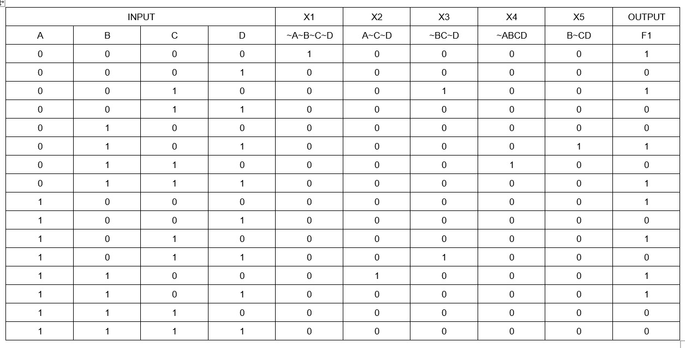

# Experiment--02-Implementation-of-combinational-logic
 
## AIM:
To implement the given logic function verify its operation in Quartus using Verilog programming.
 F1= A’B’C’D’+AC’D’+B’CD’+A’BCD+BC’D
F2=xy’z+x’y’z+w’xy+wx’y+wxy
 
## Equipments Required:
## Hardware – PCs, Cyclone II , USB flasher
## Software – Quartus prime

## Theory:

A combinational circuit is a circuit in which the output depends on the present combination of inputs.
Combinational circuits are made up of logic gates. The output of each logic gate is determined by its logic function. Combinational circuits can be made using various logic gates, such as AND gates, OR gates, and NOT gates.

## Procedure:

1.	Create a New Project:

Open Quartus and create a new project by selecting "File" > "New Project Wizard."
Follow the wizard's instructions to set up your project, including specifying the project name, location, and target device (FPGA).

2.	Create a New Design File:

Once the project is created, right-click on the project name in the Project Navigator and select "Add New File."
Choose "Verilog HDL File" or "VHDL File," depending on your chosen hardware description language.

3.	Write the Combinational Logic Code:

Open the newly created Verilog or VHDL file and write the code for your combinational logic.

4.	Compile the Project:

To compile the project, click on "Processing" > "Start Compilation" in the menu.
Quartus will analyze your code, synthesize it into a netlist, and perform optimizations based on your target FPGA device.

5.	Analyze and Fix Errors:*
 
If there are any errors or warnings during the compilation process, Quartus will display them in the Messages window.
Review and fix any issues in your code if necessary.
View the RTL diagram.

6.*Verification:

Click on "File" > "New" > "Verification/Debugging Files" > "University Program VWF".
Once Waveform is created Right Click on the Input/Output Panel > " Insert Node or Bus" > Click on Node Finder > Click On "List" > Select All.
Give the Input Combinations according to the Truth Table amd then simulate the Output Waveform.

## Program:
/*
Program to implement the given logic function and to verify its operations in quartus using Verilog programming.
Developed by: S V SHADHANASHREE
RegisterNumber:  23013434
*/

## RTL:

## Truth table:

## Timing Diagram

## Result:
Thus the given logic functions are implemented using  and their operations are verified using Verilog programming.
